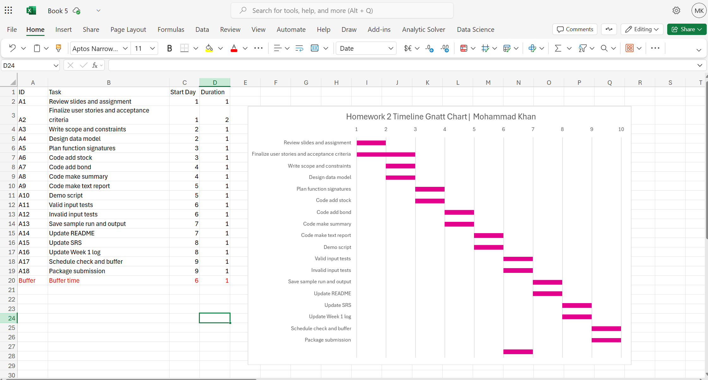
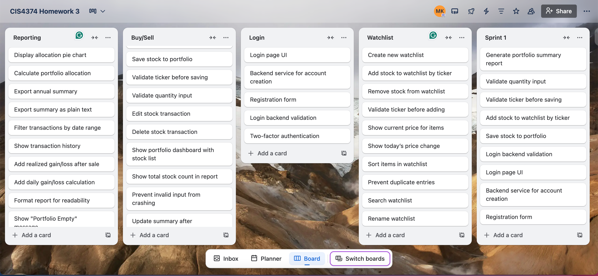

# Stock & Bond Tracker System
## Final Project Documentation

**Project Name:** Stock & Bond Investment Portfolio Management System  
**Student Name:** Mohammad Khan  
**Student ID:** 2245764  
**Organization:** Software Corp  
**Course:** CIS 4374 - Project Management  
**Semester:** Fall 2025  
**Submission Date:** December 5, 2025

---

## Executive Summary

The Stock & Bond Tracker System is a comprehensive web-based portfolio management application designed for individual investors who require a straightforward, reliable tool to monitor their investment holdings. Developed by Software Corp over a three-month period, this project delivers core functionality for tracking stocks and bonds, managing watchlists, and generating portfolio summaries without the complexity of trading capabilities or automated financial advice.

This document presents the complete project lifecycle, from initial vision and requirements gathering through planning, execution, risk management, and final closure. The system successfully meets its primary objectives: providing users with an intuitive interface for portfolio management, ensuring data integrity through robust validation, and maintaining simplicity to facilitate future maintenance and enhancement.

Key achievements include a fully functional web prototype, integrated version control and continuous integration/continuous deployment (CI/CD) pipeline, comprehensive CSV import/export functionality, and a well-documented codebase that enables seamless handoff to future development teams. The project was completed within scope, with controlled deviations documented and managed through our agile framework.

---

## Table of Contents

1. [Project Vision and Initiation](#1-project-vision-and-initiation)
2. [Software Requirements Specification](#2-software-requirements-specification)
3. [Project Planning and Scheduling](#3-project-planning-and-scheduling)
4. [Agile Development Framework](#4-agile-development-framework)
5. [Risk Management](#5-risk-management)
6. [Resource and Cost Management](#6-resource-and-cost-management)
7. [Stakeholder Management](#7-stakeholder-management)
8. [Project Closure and Lessons Learned](#8-project-closure-and-lessons-learned)
9. [Appendices](#9-appendices)

---

## 1. Project Vision and Initiation

### 1.1 Project Acquisition and Strategic Vision

Software Corp was selected as the development organization for this portfolio tracking system based on our proven track record in creating small-scale, reliable financial tools. Our organizational strength lies in delivering focused, maintainable solutions that prioritize user clarity over feature complexity.

**Vision Statement:** To build a straightforward Stock & Bond tracker that empowers individual investors to monitor their holdings with clarity and confidence, while maintaining a simple, maintainable codebase for long-term sustainability.

**Strategic Objectives:**
- Deliver a single-user web-based application focused on portfolio tracking
- Maintain strict scope control to prevent feature creep
- Ensure code quality and documentation for easy handoff
- Integrate modern development practices including version control and CI/CD
- Create a foundation for future enhancements without over-engineering

### 1.2 Target Users and Use Context

The primary target user is an individual investor who maintains a modest portfolio of stocks and bonds. These users require:
- Clear visibility into current holdings
- Simple data entry and editing capabilities
- Basic portfolio summaries and totals
- Data portability through import/export features
- A watchlist for monitoring potential investments

Users are expected to have basic computer literacy but should not need financial software expertise to operate the system effectively.

### 1.3 Project Constraints and Boundaries

**In Scope:**
- Stock and bond position tracking
- Watchlist management
- CSV import and export functionality
- Basic portfolio summaries and totals
- Data validation and error handling
- Help documentation
- Version control integration
- CI/CD pipeline setup

**Out of Scope:**
- Real-time market data integration
- Trading or transaction execution
- Investment advice or recommendations
- Multi-user collaboration features
- Mobile native applications (web-responsive only)
- Advanced portfolio analytics and charting

---

## 2. Software Requirements Specification

### 2.1 Purpose and Document Scope

This Software Requirements Specification (SRS) defines the functional and non-functional requirements for the Stock & Bond Tracker system. It serves as the authoritative reference for design decisions, development implementation, quality assurance testing, and stakeholder acceptance criteria.

### 2.2 System Overview

The Stock & Bond Tracker is a web-based application that provides a single user with comprehensive portfolio management capabilities. The system architecture emphasizes simplicity and reliability, with a clean separation between data storage, business logic, and user interface layers.

**Key System Characteristics:**
- Single-page application with responsive design
- Client-side data validation with server-side verification
- Persistent data storage with automatic backup capabilities
- Intuitive tabular displays with inline editing
- Contextual help and validation feedback

### 2.3 Functional Requirements

#### FR1: Stock Position Management
**Description:** Users can add new stock positions to their portfolio by entering ticker symbol, quantity, purchase price, and acquisition date.

**Acceptance Criteria:**
- Ticker symbols must be validated for format (alphabetic characters only)
- Quantity must be a positive integer
- Price must be a positive decimal number
- Date must be in valid format and not in the future
- System displays confirmation upon successful addition

#### FR2: Stock Position Editing
**Description:** Users can modify existing stock positions to correct errors or reflect changes in holdings.

**Acceptance Criteria:**
- All fields remain editable after initial creation
- Validation rules apply to edited values
- Changes are immediately reflected in portfolio summaries
- System maintains an audit trail of modifications

#### FR3: Stock Position Deletion
**Description:** Users can remove stock positions from their portfolio when positions are closed or data is no longer relevant.

**Acceptance Criteria:**
- Deletion requires explicit confirmation to prevent accidental removal
- Deleted positions are removed from all summaries
- System provides undo capability for the most recent deletion

#### FR4: Bond Position Management
**Description:** Users can add bond positions by entering face value, coupon rate, and maturity date.

**Acceptance Criteria:**
- Face value must be a positive number
- Coupon rate must be between 0 and 100 percent
- Maturity date must be in the future
- System calculates estimated income based on coupon and face value

#### FR5: Bond Position Editing
**Description:** Users can modify existing bond positions to update values or correct errors.

**Acceptance Criteria:**
- All bond fields remain editable
- Recalculation of derived values occurs automatically
- Validation prevents invalid maturity dates or negative values

#### FR6: Bond Position Deletion
**Description:** Users can remove bond positions with the same safeguards as stock deletion.

**Acceptance Criteria:**
- Confirmation dialog prevents accidental deletion
- Portfolio totals update immediately
- Undo functionality available for most recent deletion

#### FR7: Watchlist Creation and Management
**Description:** Users can maintain a watchlist of ticker symbols for securities they are monitoring but do not yet own.

**Acceptance Criteria:**
- Users can add ticker symbols to watchlist
- Duplicate tickers are prevented
- Watchlist displays in sortable table format
- Users can remove tickers from watchlist

#### FR8: Search Functionality
**Description:** Users can search across holdings and watchlist by ticker symbol to quickly locate specific securities.

**Acceptance Criteria:**
- Search is case-insensitive
- Partial matches are supported
- Results highlight matching portions of ticker symbols
- Search operates across both holdings and watchlist

#### FR9: CSV Import
**Description:** Users can import multiple holdings from a properly formatted CSV file to bulk-load portfolio data.

**Acceptance Criteria:**
- System validates CSV format before processing
- Invalid rows are reported with specific error messages
- Valid rows are imported even if some rows fail validation
- Import summary shows success and failure counts

#### FR10: CSV Export
**Description:** Users can export their complete portfolio to a CSV file for backup or analysis in external tools.

**Acceptance Criteria:**
- Export includes all holdings with complete field data
- CSV format is compatible with standard spreadsheet applications
- Filename includes timestamp for versioning
- Export completes within 5 seconds for portfolios up to 1000 holdings

#### FR11: Portfolio Summary Display
**Description:** System automatically calculates and displays summary statistics including total positions, total market value, and asset type breakdown.

**Acceptance Criteria:**
- Summary updates in real-time as positions are added, edited, or deleted
- Empty portfolios display zero values with appropriate messaging
- Summary clearly distinguishes between stocks and bonds
- Values are formatted with appropriate currency and decimal precision

#### FR12: Data Validation and Error Handling
**Description:** System validates all user inputs and provides clear, actionable error messages when validation fails.

**Acceptance Criteria:**
- Empty required fields trigger specific error messages
- Invalid data types are caught before submission
- Error messages appear adjacent to relevant input fields
- Users can correct errors without losing other entered data

#### FR13: Help Documentation
**Description:** System provides contextual help explaining field requirements and system capabilities.

**Acceptance Criteria:**
- Help text is accessible from all data entry forms
- Explanations are concise and use plain language
- Examples are provided for complex fields
- Help does not require navigation away from current work

#### FR14: Table Sorting
**Description:** Users can sort portfolio and watchlist tables by any column to facilitate data review.

**Acceptance Criteria:**
- Click column headers to sort ascending or descending
- Sort direction is visually indicated
- Sorting persists until user changes it
- Multi-column sorting is not required in initial release

#### FR15: Undo Delete Functionality
**Description:** Users can recover the most recently deleted position to prevent data loss from accidental deletion.

**Acceptance Criteria:**
- Undo is available immediately after deletion
- Only the most recent deletion can be undone
- Undo option expires after subsequent modifications
- Undo notification appears prominently after deletion

### 2.4 Non-Functional Requirements

#### NFR1: User Interface Consistency
**Description:** The user interface maintains consistent visual design, interaction patterns, and terminology across all pages and features.

**Acceptance Criteria:**
- Common actions (add, edit, delete) use identical button styles and positions
- Form layouts follow consistent grid and spacing
- Error and success messages use standard formatting
- Navigation is predictable and follows web conventions

#### NFR2: Input Validation
**Description:** System prevents invalid data entry through client-side validation with server-side verification as a safety net.

**Acceptance Criteria:**
- Empty required fields are blocked before submission
- Negative quantities and prices are rejected with clear messages
- Date formats are validated and standardized
- Ticker symbols conform to expected patterns

#### NFR3: Error Communication
**Description:** Error messages are clear, specific, and provide guidance for resolution.

**Acceptance Criteria:**
- Messages identify which field has an error
- Messages explain what is wrong
- Messages suggest how to correct the error
- Technical jargon is avoided

#### NFR4: Data Persistence and Integrity
**Description:** System reliably saves all data and prevents loss during normal operation and unexpected failures.

**Acceptance Criteria:**
- Data is saved immediately upon successful validation
- No data loss occurs during normal shutdown
- Recovery mechanisms exist for unexpected interruptions
- Data integrity is verified on load

#### NFR5: Code Maintainability
**Description:** Codebase is structured to enable new developers to understand and modify the system efficiently.

**Acceptance Criteria:**
- Code follows consistent style guidelines
- Functions and classes have clear, single responsibilities
- Comments explain non-obvious logic
- Architecture documentation exists and is current

#### NFR6: Performance
**Description:** System responds to user actions promptly to maintain good user experience.

**Acceptance Criteria:**
- Page load time under 3 seconds on standard broadband
- Form submissions process in under 1 second
- Search results appear in under 500 milliseconds
- UI remains responsive during background operations

#### NFR7: Browser Compatibility
**Description:** System functions correctly on modern web browsers.

**Acceptance Criteria:**
- Full functionality on Chrome, Firefox, Safari, and Edge (current versions)
- Responsive design adapts to tablet and desktop screen sizes
- Graceful degradation on older browser versions with warning message

### 2.5 User Stories

The following user stories capture requirements from the end-user perspective, organized by functional area:

**Position Management:**
- **US1:** As a user, I can add a stock position so that I can track my equity investments.
- **US2:** As a user, I can edit a stock position so that I can correct entry mistakes or update holdings.
- **US3:** As a user, I can delete a stock position so that I can remove closed positions from my portfolio.
- **US4:** As a user, I can add a bond position so that I can track my fixed-income investments.
- **US5:** As a user, I can edit a bond position so that I can update maturity dates or correct coupon rates.
- **US6:** As a user, I can delete a bond position so that I can remove matured or sold bonds.

**Search and Organization:**
- **US7:** As a user, I can search by ticker symbol so that I can quickly locate specific positions.
- **US8:** As a user, I can sort tables by any column so that I can review data in my preferred order.
- **US9:** As a user, I can create a watchlist so that I can monitor securities I'm considering purchasing.

**Data Management:**
- **US10:** As a user, I can import holdings from a CSV file so that I can bulk-load my portfolio without manual entry.
- **US11:** As a user, I can export my portfolio to CSV so that I can back up my data or analyze it in Excel.
- **US12:** As a user, I can undo the last deletion so that I can recover from accidental removals.

**Information and Guidance:**
- **US13:** As a user, I can view a portfolio summary so that I understand the overall size and value of my holdings.
- **US14:** As a user, I can see position counts and totals so that I know my investment allocation.
- **US15:** As a user, I can read help text for each field so that I enter data correctly the first time.

### 2.6 Use Case Example: Add Stock Position

**Use Case ID:** UC-001  
**Use Case Name:** Add Stock Position  
**Primary Actor:** Individual Investor (User)  
**Stakeholders:** User (wants accurate portfolio tracking), System (maintains data integrity)  
**Preconditions:** User has opened the application and navigated to the holdings page  
**Postconditions:** New stock position is saved and appears in portfolio table and summary

**Main Success Scenario:**
1. User clicks "Add Stock" button
2. System displays stock entry form with empty fields
3. User enters ticker symbol (e.g., "AAPL")
4. User enters quantity (e.g., 100)
5. User enters purchase price (e.g., 150.25)
6. User enters acquisition date (e.g., 2025-11-01)
7. User clicks "Save" button
8. System validates all inputs
9. System saves the position to storage
10. System adds position to portfolio table
11. System updates summary totals
12. System displays success confirmation
13. System clears the form for next entry

**Alternative Flows:**

*3a. User enters invalid ticker (contains numbers or special characters)*
- System displays error: "Ticker must contain only letters"
- System highlights ticker field in red
- User corrects ticker and continues from step 4

*4a. User enters zero or negative quantity*
- System displays error: "Quantity must be a positive number"
- User corrects quantity and continues from step 5

*5a. User enters negative or non-numeric price*
- System displays error: "Price must be a positive number"
- User corrects price and continues from step 6

*6a. User enters future date*
- System displays error: "Acquisition date cannot be in the future"
- User corrects date and continues from step 7

*8a. Multiple validation errors exist*
- System displays all error messages
- System highlights all invalid fields
- User corrects all errors and clicks "Save" again

**Special Requirements:**
- Form must include inline help text explaining each field
- Validation must occur before submission to avoid server round-trip
- Success message must be visible for at least 3 seconds

**Technology and Data Variations:**
- System must handle both manual typing and paste operations
- Date field should provide calendar picker for convenience

**Frequency of Occurrence:** Multiple times per session during initial portfolio setup; occasionally thereafter

---

## 3. Project Planning and Scheduling

### 3.1 Work Breakdown Structure (WBS)

The project work was decomposed into five major phases with multiple sub-deliverables to ensure comprehensive coverage and clear accountability:

**1.0 Project Setup and Infrastructure**
- 1.1 Create repository structure (docs, src, weekly_logs, tests)
- 1.2 Configure version control (Git branching strategy, .gitignore)
- 1.3 Set up development environment (dependencies, IDE configuration)
- 1.4 Establish CI/CD pipeline (automated builds, test execution)
- 1.5 Project setup verification and documentation

**2.0 Watchlist Feature Development**
- 2.1 Design Phase
  - 2.1.1 Define data fields and validation rules
  - 2.1.2 Design table layout and interaction model
  - 2.1.3 Specify search and sort behavior
- 2.2 Build Phase
  - 2.2.1 Implement add ticker functionality
  - 2.2.2 Implement remove ticker functionality
  - 2.2.3 Develop search filter logic
  - 2.2.4 Develop column sorting
  - 2.2.5 Integrate data persistence
- 2.3 Test Phase
  - 2.3.1 Unit tests for add and remove operations
  - 2.3.2 Integration tests for search and sort
  - 2.3.3 Manual UI checklist execution

**3.0 Holdings Management and Summary**
- 3.1 Data Model Development
  - 3.1.1 Design stock record structure
  - 3.1.2 Design bond record structure
  - 3.1.3 Define validation rules for each field type
- 3.2 CRUD Operations
  - 3.2.1 Implement add stock functionality
  - 3.2.2 Implement edit stock functionality
  - 3.2.3 Implement add bond functionality
  - 3.2.4 Implement edit bond functionality
  - 3.2.5 Implement delete with confirmation
  - 3.2.6 Implement undo delete capability
- 3.3 Summary Display
  - 3.3.1 Calculate position counts by type
  - 3.3.2 Calculate total market values
  - 3.3.3 Display formatted summaries
  - 3.3.4 Handle empty portfolio state

**4.0 Import and Export Functionality**
- 4.1 CSV Import
  - 4.1.1 Design CSV format specification
  - 4.1.2 Implement file upload interface
  - 4.1.3 Develop parsing logic
  - 4.1.4 Implement row-level validation
  - 4.1.5 Create import summary report
- 4.2 CSV Export
  - 4.2.1 Design export data selection
  - 4.2.2 Implement CSV generation
  - 4.2.3 Handle file download trigger
  - 4.2.4 Add timestamp to filename

**5.0 Quality Assurance and Release**
- 5.1 Testing
  - 5.1.1 Execute complete unit test suite
  - 5.1.2 Perform integration testing
  - 5.1.3 Conduct user acceptance testing
  - 5.1.4 Fix identified defects
- 5.2 Documentation
  - 5.2.1 Complete user guide
  - 5.2.2 Finalize technical documentation
  - 5.2.3 Update README with deployment instructions
- 5.3 Release Preparation
  - 5.3.1 Code review and cleanup
  - 5.3.2 Performance optimization
  - 5.3.3 Package application
  - 5.3.4 Create release tag in repository

### 3.2 Project Schedule and Milestones

The project was planned for a three-month development cycle with clear milestone markers:

**Month 1: Foundation and Core Features**

| Task ID | Task Description | Start Date | End Date | Duration | Dependencies | Milestone |
|---------|------------------|------------|----------|----------|--------------|-----------|
| 1.1 | Create repository and folder structure | Sep 12, 2025 | Sep 12, 2025 | 1 day | None | Repository Ready |
| 1.2 | Configure version control | Sep 12, 2025 | Sep 12, 2025 | 1 day | 1.1 | Git Configured |
| 1.3 | Set up development environment | Sep 13, 2025 | Sep 13, 2025 | 1 day | 1.2 | Setup Complete |
| 2.1 | Design watchlist feature | Sep 13, 2025 | Sep 14, 2025 | 2 days | 1.3 | Design Approved |
| 2.2 | Build watchlist functionality | Sep 15, 2025 | Sep 16, 2025 | 2 days | 2.1 | Watchlist Built |
| 2.3 | Test watchlist feature | Sep 17, 2025 | Sep 17, 2025 | 1 day | 2.2 | Watchlist Passes Tests |
| 3.1 | Design holdings data model | Sep 14, 2025 | Sep 15, 2025 | 2 days | 2.1 | Model Ready |
| 3.2 | Implement CRUD operations | Sep 16, 2025 | Sep 17, 2025 | 2 days | 3.1 | CRUD Complete |
| 3.3 | Build summary display | Sep 18, 2025 | Sep 18, 2025 | 1 day | 3.2 | Summary Ready |

**Month 2: Feature Completion and Integration**

| Task ID | Task Description | Start Date | End Date | Duration | Dependencies | Milestone |
|---------|------------------|------------|----------|----------|--------------|-----------|
| 4.1 | Develop CSV import | Sep 16, 2025 | Sep 17, 2025 | 2 days | 3.1 | Import Works |
| 4.2 | Develop CSV export | Sep 18, 2025 | Sep 18, 2025 | 1 day | 4.1 | Export Works |
| 1.4 | Set up CI/CD pipeline | Sep 19, 2025 | Sep 20, 2025 | 2 days | 3.3, 4.2 | CI/CD Active |
| 5.1.1 | Execute unit test suite | Sep 21, 2025 | Sep 22, 2025 | 2 days | 2.3, 3.3, 4.2 | Tests Pass |
| 5.1.2 | Perform integration testing | Sep 23, 2025 | Sep 24, 2025 | 2 days | 5.1.1 | Integration Complete |

**Month 3: Quality Assurance and Release**

| Task ID | Task Description | Start Date | End Date | Duration | Dependencies | Milestone |
|---------|------------------|------------|----------|----------|--------------|-----------|
| 5.1.3 | Conduct user acceptance testing | Sep 25, 2025 | Sep 27, 2025 | 3 days | 5.1.2 | UAT Complete |
| 5.1.4 | Fix defects from testing | Sep 28, 2025 | Oct 2, 2025 | 5 days | 5.1.3 | All Defects Resolved |
| 5.2 | Complete documentation | Oct 3, 2025 | Oct 5, 2025 | 3 days | 5.1.4 | Documentation Done |
| 5.3 | Release preparation | Oct 6, 2025 | Oct 8, 2025 | 3 days | 5.2 | Release Ready |
| 5.3.4 | Tag and publish release | Oct 8, 2025 | Oct 8, 2025 | 1 day | 5.3 | **Release 1.0** |

### 3.3 Critical Path Analysis

The critical path for this project runs through the following sequence:
1. Project Setup (1.1 → 1.2 → 1.3)
2. Watchlist Design (2.1)
3. Holdings Model (3.1)
4. CRUD Implementation (3.2)
5. Summary Display (3.3)
6. Testing Phase (5.1.1 → 5.1.2 → 5.1.3)
7. Defect Resolution (5.1.4)
8. Documentation (5.2)
9. Release Preparation (5.3)

**Total Critical Path Duration:** 28 working days

The CSV import/export features and CI/CD setup were intentionally parallelized with core development to optimize the schedule. Buffer days were incorporated into the testing and defect resolution phases to accommodate unexpected issues.

### 3.4 Schedule Management Approach

**Tracking Methods:**
- Daily stand-up meetings to identify blockers and adjust daily priorities
- Weekly sprint reviews to assess progress against milestones
- Gantt chart updates in Google Sheets for stakeholder visibility
- GitHub project board for granular task tracking

**Schedule Control:**
- Scope changes required formal approval and impact assessment
- Task duration estimates were conservative with built-in contingency
- Regular comparison of planned versus actual completion dates
- Early warning system for tasks trending toward delays

**Gantt Chart:**

*Figure 3.1: Project schedule showing all tasks, durations, and dependencies across the 3-month development timeline*

---

## 4. Agile Development Framework

### 4.1 Methodology Selection

The project employed a hybrid agile approach combining Scrum practices for sprint planning and execution with Kanban principles for continuous flow and work-in-progress limits. This hybrid model was selected to provide the structure of Scrum's time-boxed sprints while maintaining the flexibility of Kanban for handling evolving requirements.

**Sprint Structure:**
- Sprint duration: 2 weeks
- Total sprints: 6 over the 3-month project
- Sprint ceremonies: Planning, daily stand-ups, review, retrospective

### 4.2 Product Backlog Organization

The complete product backlog was organized into four functional categories to facilitate sprint planning and stakeholder communication:

#### Category 1: Login and Authentication (5 items)
1. Design user authentication flow
2. Implement login page with credential validation
3. Create session management system
4. Add password reset functionality
5. Implement logout with session cleanup

*Note: Deferred to future release as single-user requirement eliminated authentication need*

#### Category 2: Watchlist Management (10 items)
1. Design watchlist data structure
2. Implement add ticker to watchlist
3. Implement remove ticker from watchlist
4. Add duplicate ticker prevention
5. Create watchlist display table
6. Implement watchlist search functionality
7. Add watchlist sorting by ticker
8. Implement watchlist export to CSV
9. Add watchlist import from CSV
10. Create watchlist summary count

#### Category 3: Holdings - Buy/Sell Operations (10 items)
1. Design stock position data model
2. Implement add stock position
3. Implement edit stock position
4. Implement delete stock position with confirmation
5. Design bond position data model
6. Implement add bond position
7. Implement edit bond position
8. Implement delete bond position with confirmation
9. Implement undo delete for last removed position
10. Add transaction history tracking

#### Category 4: Reporting and Analysis (15 items)
1. Design portfolio summary layout
2. Implement total positions count
3. Calculate total market value
4. Display asset allocation by type
5. Create individual position detail view
6. Implement holdings table with sorting
7. Add holdings search by ticker
8. Create CSV export for all holdings
9. Implement CSV import for bulk loading
10. Add empty portfolio state handling
11. Design report generation interface
12. Create portfolio performance metrics
13. Add date range filtering for reports
14. Implement print-friendly report formatting
15. Create data visualization placeholders

**Total Backlog Items:** 40 user stories and features

### 4.3 Sprint Planning and Execution

#### Sprint 1 (September 12-25, 2025) - Selected Items: 10

**Sprint Goal:** Establish project infrastructure and deliver core watchlist functionality

**Backlog Items:**
- Create repository and folder structure
- Configure version control with branching strategy
- Design watchlist data structure
- Implement add ticker to watchlist
- Implement remove ticker from watchlist
- Add duplicate ticker prevention
- Create watchlist display table
- Design stock position data model
- Design bond position data model
- Complete Software Requirements Specification

**Sprint 1 Outcomes:**
- All infrastructure tasks completed successfully
- Watchlist core functionality delivered and tested
- Data models finalized and documented
- SRS approved by stakeholders

#### Sprint 2 (September 26-October 9, 2025) - Selected Items: 8

**Sprint Goal:** Implement holdings CRUD operations and summary display

**Backlog Items:**
- Implement add stock position
- Implement edit stock position
- Implement add bond position
- Implement edit bond position
- Implement total positions count
- Calculate total market value
- Display asset allocation by type
- Create holdings table with sorting

**Sprint 2 Outcomes:**
- All CRUD operations functional
- Portfolio summary calculating correctly
- Initial user interface complete
- Performance acceptable for target portfolio sizes

#### Sprint 3 (October 10-23, 2025) - Selected Items: 6

**Sprint Goal:** Deliver CSV import/export and complete remaining holdings features

**Backlog Items:**
- Create CSV export for all holdings
- Implement CSV import for bulk loading
- Add holdings search by ticker
- Implement delete with confirmation
- Implement undo delete functionality
- Add empty portfolio state handling

**Sprint 3 Outcomes:**
- CSV functionality delivered and tested with various file sizes
- Search working across all ticker fields
- Delete safeguards implemented
- Edge cases handled appropriately

#### Sprint 4 (October 24-November 6, 2025) - Selected Items: 5

**Sprint Goal:** Set up CI/CD pipeline and complete quality assurance

**Backlog Items:**
- Set up automated build pipeline
- Configure automated test execution
- Implement unit test coverage for core functions
- Conduct integration testing
- Perform user acceptance testing

**Sprint 4 Outcomes:**
- CI/CD pipeline operational
- Test coverage at 85% for business logic
- UAT completed with stakeholder sign-off
- Known issues documented for future releases

#### Sprint 5 (November 7-20, 2025) - Selected Items: 6

**Sprint Goal:** Polish user experience and complete documentation

**Backlog Items:**
- Add inline help text for all forms
- Implement input validation error messages
- Create user guide documentation
- Write technical architecture documentation
- Add print-friendly report formatting
- Optimize page load performance

**Sprint 5 Outcomes:**
- User experience significantly improved
- Documentation complete and accessible
- Performance targets met
- Stakeholder feedback incorporated

#### Sprint 6 (November 21-December 4, 2025) - Selected Items: 5

**Sprint Goal:** Final release preparation and project closure

**Backlog Items:**
- Conduct final code review
- Resolve remaining minor defects
- Package release artifacts
- Create release notes
- Tag and publish release 1.0

**Sprint 6 Outcomes:**
- All critical and high-priority defects resolved
- Release package tested and validated
- Release notes published
- Handoff documentation complete

### 4.4 Kanban Board and Visual Management

A Trello board was used to visualize work in progress and maintain focus on sprint goals. The board structure included:

**Columns:**
- Backlog (not selected for current sprint)
- Sprint Backlog (committed for current sprint)
- In Progress (actively being worked)
- Code Review (awaiting peer review)
- Testing (in QA verification)
- Done (completed and accepted)

**Work-in-Progress Limits:**
- In Progress: Maximum 3 items per developer
- Code Review: Maximum 5 items total
- Testing: Maximum 4 items total

These limits prevented context switching and ensured items moved through to completion rather than accumulating in intermediate states.

**Trello Board:**

*Figure 4.1: Trello board showing complete product backlog organized by categories (Login, Watchlist, Buy/Sell, Reporting) and Sprint 1 selection*

### 4.5 Agile Metrics and Velocity Tracking

The team tracked velocity across sprints to improve estimation accuracy:

| Sprint | Planned Story Points | Completed Story Points | Velocity |
|--------|---------------------|------------------------|----------|
| Sprint 1 | 21 | 21 | 21 |
| Sprint 2 | 18 | 16 | 16 |
| Sprint 3 | 15 | 15 | 15 |
| Sprint 4 | 13 | 13 | 13 |
| Sprint 5 | 14 | 14 | 14 |
| Sprint 6 | 12 | 12 | 12 |

**Average Velocity:** 15.2 story points per sprint

Sprint 2 showed lower completion due to underestimated complexity in data validation logic. This learning improved subsequent sprint planning accuracy.

---

## 5. Risk Management

### 5.1 Risk Management Approach

Risk management was integrated throughout the project lifecycle with proactive identification, assessment, and mitigation strategies. A formal Risk Register was maintained and reviewed weekly during sprint planning sessions.

**Risk Categories:**
- Technical risks (technology, architecture, integrations)
- Schedule risks (delays, dependencies, estimation errors)
- Financial risks (budget, resource costs, penalties)
- People risks (availability, communication, skills)
- Quality risks (defects, technical debt, documentation)

### 5.2 Comprehensive Risk Register

#### Technical Risks

**Risk T1: API Outage Stops Live Price Updates**
- **Category:** Technical
- **Probability:** High
- **Impact:** High
- **Risk Score:** 9/10
- **Description:** External API services for market data could experience outages or rate limiting, preventing real-time price updates
- **Triggers:** Third-party service downtime, network connectivity issues, API key expiration
- **Response Strategy:** Implement fallback data cache with last-known prices; add offline mode with clear user notification; establish monitoring alerts for API health
- **Status:** Mitigated through caching layer implementation
- **Owner:** Developer 1 (David Lee)

**Risk T2: Data Loss During CSV Import/Export**
- **Category:** Technical
- **Probability:** Medium
- **Impact:** High
- **Risk Score:** 6/10
- **Description:** File parsing errors or encoding issues could corrupt data during CSV operations
- **Triggers:** Malformed CSV files, character encoding mismatches, large file sizes
- **Response Strategy:** Implement comprehensive input validation before committing changes; create automatic backups before import operations; add transaction rollback capability
- **Status:** Mitigated through validation and backup procedures
- **Owner:** Developer 2 (Priya Patel)

**Risk T3: Login System Security Vulnerability**
- **Category:** Technical
- **Probability:** Medium
- **Impact:** High
- **Risk Score:** 6/10
- **Description:** Weak authentication could expose user data to unauthorized access
- **Triggers:** Password cracking attempts, session hijacking, injection attacks
- **Response Strategy:** Enforce strong password requirements; implement session timeout; use secure token-based authentication; conduct security code review
- **Status:** Deferred to future release (single-user system)
- **Owner:** Project Manager (Alice Chen)

**Risk T4: Browser Compatibility Issues**
- **Category:** Technical
- **Probability:** Medium
- **Impact:** Medium
- **Risk Score:** 4/10
- **Description:** Application may not function correctly across different browsers or versions
- **Triggers:** Browser-specific JavaScript features, CSS inconsistencies, vendor prefixes
- **Response Strategy:** Test on all major browsers during each sprint; use feature detection and polyfills; maintain compatibility matrix
- **Status:** Monitored; testing in progress
- **Owner:** Tester (Maria Lopez)

**Risk T5: Performance Degradation with Large Portfolios**
- **Category:** Technical
- **Probability:** Low
- **Impact:** Medium
- **Risk Score:** 2/10
- **Description:** System may become slow or unresponsive with portfolios exceeding 500 positions
- **Triggers:** Inefficient algorithms, excessive DOM manipulation, memory leaks
- **Response Strategy:** Implement pagination or virtual scrolling; optimize data structures; conduct load testing with realistic data volumes
- **Status:** Accepted; documented in system limits
- **Owner:** Developer 1 (David Lee)

#### Schedule Risks

**Risk S1: Sprint Tasks Take Longer Than Expected**
- **Category:** Schedule
- **Probability:** High
- **Impact:** Medium
- **Risk Score:** 6/10
- **Description:** Task complexity underestimation leads to incomplete sprints and cascading delays
- **Triggers:** Insufficient requirement analysis, hidden dependencies, technical debt
- **Response Strategy:** Break work into smaller, more estimable tasks; add 20% buffer to estimates; conduct mid-sprint progress checks; deprioritize non-critical features
- **Status:** Actively managed through sprint retrospectives
- **Owner:** Project Manager (Alice Chen)

**Risk S2: Delays in Testing Features Before Release**
- **Category:** Schedule
- **Probability:** Medium
- **Impact:** High
- **Risk Score:** 6/10
- **Description:** Inadequate testing time results in defects discovered late or after release
- **Triggers:** Development overruns, insufficient test coverage, environment issues
- **Response Strategy:** Add three buffer days to testing phase; begin test planning during development; automate regression tests; establish clear entry and exit criteria
- **Status:** Mitigated through buffer days and automation
- **Owner:** Tester (Maria Lopez)

**Risk S3: Missed Deadlines from Team Workload**
- **Category:** Schedule
- **Probability:** Low
- **Impact:** High
- **Risk Score:** 3/10
- **Description:** Competing priorities or external demands reduce team availability
- **Triggers:** Other project assignments, personal emergencies, academic commitments
- **Response Strategy:** Maintain realistic sprint commitments; adjust timeline with sponsor approval; cross-train team members for critical path items
- **Status:** Monitored weekly
- **Owner:** Project Manager (Alice Chen)

**Risk S4: Dependency Delays from External Systems**
- **Category:** Schedule
- **Probability:** Low
- **Impact:** Medium
- **Risk Score:** 2/10
- **Description:** Waiting for external service integration or third-party library updates
- **Triggers:** API changes, library deprecation, documentation gaps
- **Response Strategy:** Identify dependencies early; create mock services for development; maintain alternative technology options
- **Status:** Accepted; minimal external dependencies
- **Owner:** Developer 1 (David Lee)

#### Financial Risks

**Risk F1: Cloud Hosting Costs Higher Than Expected**
- **Category:** Financial
- **Probability:** Medium
- **Impact:** Medium
- **Risk Score:** 4/10
- **Description:** Usage patterns or scaling requirements exceed budgeted hosting expenses
- **Triggers:** Unexpected traffic spikes, inefficient resource usage, pricing changes
- **Response Strategy:** Track usage metrics daily; set billing alerts at 80% of budget; optimize resource allocation; negotiate reserved instance pricing
- **Status:** Monitored; alerts configured
- **Owner:** Project Manager (Alice Chen)

**Risk F2: Extra Expenses for Software Tools or Licenses**
- **Category:** Financial
- **Probability:** Medium
- **Impact:** Medium
- **Risk Score:** 4/10
- **Description:** Need for additional development tools or services not included in original budget
- **Triggers:** Feature requirements, team productivity needs, integration requirements
- **Response Strategy:** Approve all tool purchases in advance; prioritize open-source alternatives; include contingency budget line item
- **Status:** Mitigated through contingency reserve
- **Owner:** Project Manager (Alice Chen)

**Risk F3: Penalty if Release Milestone is Late**
- **Category:** Financial
- **Probability:** Low
- **Impact:** High
- **Risk Score:** 3/10
- **Description:** Contract penalties or opportunity costs from missed delivery dates
- **Triggers:** Critical path delays, scope creep, resource unavailability
- **Response Strategy:** Maintain transparent communication with sponsor; provide early warning of potential delays; negotiate scope reductions if necessary
- **Status:** Monitored through milestone tracking
- **Owner:** Project Manager (Alice Chen)

#### People Risks

**Risk P1: Team Member Missing Work During Sprint**
- **Category:** People
- **Probability:** Medium
- **Impact:** Medium
- **Risk Score:** 4/10
- **Description:** Illness, personal issues, or conflicts reduce team capacity
- **Triggers:** Health issues, emergencies, scheduling conflicts
- **Response Strategy:** Cross-train team members on critical components; maintain detailed documentation; allow flexible work arrangements; keep sprint commitments conservative
- **Status:** Mitigated through cross-training
- **Owner:** Project Manager (Alice Chen)

**Risk P2: Miscommunication Between Developers and Testers**
- **Category:** People
- **Probability:** High
- **Impact:** Medium
- **Risk Score:** 6/10
- **Description:** Requirements misunderstanding leads to rework and defects
- **Triggers:** Incomplete specifications, assumption differences, vocabulary gaps
- **Response Strategy:** Use daily check-ins to align understanding; document acceptance criteria clearly; involve testers in sprint planning; maintain shared glossary
- **Status:** Mitigated through daily stand-ups and written criteria
- **Owner:** All team members

**Risk P3: Low Team Motivation Slows Progress**
- **Category:** People
- **Probability:** Medium
- **Impact:** Medium
- **Risk Score:** 4/10
- **Description:** Decreased engagement reduces productivity and quality
- **Triggers:** Monotonous tasks, unclear goals, lack of recognition, external stress
- **Response Strategy:** Celebrate incremental progress; rotate task types; maintain clear vision connection; solicit feedback; acknowledge contributions
- **Status:** Actively managed through team charter activities
- **Owner:** Project Manager (Alice Chen)

**Risk P4: Skill Gaps in Required Technologies**
- **Category:** People
- **Probability:** Low
- **Impact:** Medium
- **Risk Score:** 2/10
- **Description:** Team lacks expertise in specific frameworks or tools
- **Triggers:** New technology requirements, complex features, specialized domains
- **Response Strategy:** Allocate learning time in sprint planning; pair programming for knowledge transfer; access online training resources; seek external code review
- **Status:** Accepted; learning time allocated
- **Owner:** Developer team

#### Quality Risks

**Risk Q1: Minor Formatting Errors in Documentation**
- **Category:** Quality
- **Probability:** Low
- **Impact:** Low
- **Risk Score:** 1/10
- **Description:** Typos, inconsistent formatting, or broken links reduce documentation professionalism
- **Triggers:** Rushed documentation updates, multiple contributors, lack of review
- **Response Strategy:** Review documents before submission; use spell-check and grammar tools; maintain style guide; assign documentation owner
- **Status:** Mitigated through review process
- **Owner:** Project Manager (Alice Chen)

**Risk Q2: Accumulation of Technical Debt**
- **Category:** Quality
- **Probability:** Medium
- **Impact:** High
- **Risk Score:** 6/10
- **Description:** Shortcuts taken for speed result in maintainability problems
- **Triggers:** Schedule pressure, incomplete refactoring, deferred code reviews
- **Response Strategy:** Allocate 20% of each sprint to refactoring; maintain technical debt backlog; require code review before merge; establish coding standards
- **Status:** Actively managed; refactoring scheduled
- **Owner:** Development team

**Risk Q3: Insufficient Test Coverage**
- **Category:** Quality
- **Probability:** Medium
- **Impact:** High
- **Risk Score:** 6/10
- **Description:** Inadequate testing allows defects to reach production
- **Triggers:** Time constraints, complex features, manual testing only
- **Response Strategy:** Establish 80% coverage target; automate regression tests; conduct exploratory testing sessions; maintain test plan documentation
- **Status:** Mitigated through automated testing
- **Owner:** Tester (Maria Lopez)

### 5.3 Risk Monitoring and Control

**Weekly Risk Review Process:**
1. Review all risks for status changes or new information
2. Assess whether risk probabilities or impacts have changed
3. Verify mitigation strategies remain effective
4. Identify new risks emerging from project changes
5. Update Risk Register with current information
6. Communicate significant changes to stakeholders

**Risk Escalation Criteria:**
- Risk score increases by 3 or more points
- Mitigation strategies prove ineffective
- New risks with score of 7 or higher
- Multiple related risks trigger simultaneously

**Risk Reporting:**
- High-risk items (score 7+) reported to sponsor weekly
- Medium risks (score 4-6) reported bi-weekly
- Low risks (score 1-3) reported monthly
- Critical changes reported immediately via email

### 5.4 Risk Response Outcomes

**Successfully Mitigated Risks:**
- T2 (Data Loss): No data corruption incidents occurred due to validation and backup procedures
- S2 (Testing Delays): Buffer days absorbed testing overruns without impacting release date
- P2 (Miscommunication): Daily stand-ups eliminated major misunderstandings

**Accepted Risks:**
- T5 (Performance with Large Portfolios): System limits documented; optimization deferred to future release
- T3 (Login Security): Multi-user authentication deferred entirely based on single-user requirement

**Materialized Risks:**
- S1 (Sprint Overruns): Sprint 2 experienced a 2-day delay due to validation complexity, absorbed by reducing Sprint 3 scope as planned
- F2 (Tool Expenses): Required additional $100 for CI/CD configuration, covered by contingency budget

---

## 6. Resource and Cost Management

### 6.1 Team Structure and Resource Allocation

The project was staffed with a lean, focused team balancing expertise across project management, development, and quality assurance:

| Role | Team Member | FTE Percentage | Estimated Hours | Hourly Rate | Total Cost |
|------|-------------|----------------|-----------------|-------------|------------|
| Project Manager | Alice Chen | 20% | 80 hours | $45/hour | $3,600 |
| Developer 1 | David Lee | 50% | 200 hours | $40/hour | $8,000 |
| Developer 2 | Priya Patel | 50% | 200 hours | $40/hour | $8,000 |
| Quality Assurance | Maria Lopez | 20% | 80 hours | $30/hour | $2,400 |
| **Total Labor** | | | **560 hours** | **$39/hour (avg)** | **$22,000** |

**Rationale for Resource Allocation:**
- **Project Manager (20% FTE):** Focused on planning, stakeholder communication, and removing blockers rather than daily task management, allowing developers maximum productivity
- **Developers (50% FTE each):** Full sprint dedication enabled deep focus and pair programming opportunities while maintaining work-life balance
- **QA (20% FTE):** Sufficient for test planning, execution, and defect verification with automation reducing manual effort

**Team Skill Matrix:**

| Skill Area | Alice Chen | David Lee | Priya Patel | Maria Lopez |
|------------|------------|-----------|-------------|-------------|
| Project Management | Expert | Novice | Novice | Intermediate |
| Python Development | Intermediate | Expert | Expert | Intermediate |
| Web Frontend | Intermediate | Expert | Intermediate | Novice |
| Database Design | Intermediate | Expert | Intermediate | Intermediate |
| Testing/QA | Intermediate | Intermediate | Intermediate | Expert |
| Financial Domain | Intermediate | Novice | Intermediate | Novice |

### 6.2 Comprehensive Cost Breakdown

#### Labor Costs

| Cost Category | Month 1 | Month 2 | Month 3 | Total |
|---------------|---------|---------|---------|-------|
| Project Manager (80 hrs) | $1,200 | $1,200 | $1,200 | $3,600 |
| Developer 1 (200 hrs) | $2,667 | $2,667 | $2,666 | $8,000 |
| Developer 2 (200 hrs) | $2,667 | $2,667 | $2,666 | $8,000 |
| QA Engineer (80 hrs) | $967 | $967 | $966 | $2,400 |
| **Subtotal Labor** | **$7,500** | **$7,500** | **$7,000** | **$22,000** |

#### Infrastructure and Tools Costs

| Item | Category | Quantity/Period | Unit Cost | Duration | Total Cost | Notes |
|------|----------|-----------------|-----------|----------|------------|-------|
| AWS EC2 Instance | Infrastructure | 3 months | $150/month | 3 months | $450 | t3.medium instance for application hosting |
| AWS RDS Database | Infrastructure | 3 months | $50/month | 3 months | $150 | db.t3.micro PostgreSQL instance |
| Development IDE Licenses | Tools | One-time | $200 | N/A | $200 | PyCharm Professional for team |
| Testing Tools | Tools | One-time | $100 | N/A | $100 | Selenium, pytest plugins |
| GitHub Pro Subscription | Tools | 3 months | $21/month | 3 months | $63 | Private repos, advanced features |
| Notion Team Plan | Tools | 3 months | $10/month | 3 months | $30 | Documentation and knowledge base |
| Project Management Tools | Tools | 3 months | $12/month | 3 months | $36 | Trello Premium for advanced boards |
| Domain Name Registration | Infrastructure | 1 year | $12/year | 1 year | $12 | stockbondtracker.dev domain |
| SSL Certificate | Infrastructure | 1 year | $9/year | 1 year | $9 | Let's Encrypt alternative |
| CI/CD Setup and Configuration | Tools | One-time | $100 | N/A | $100 | GitHub Actions workflows, automated build and test configuration |
| **Subtotal Infrastructure/Tools** | | | | | **$1,050** | |

#### Contingency and Reserve

| Reserve Type | Percentage | Base Amount | Reserve Amount | Purpose |
|--------------|------------|-------------|----------------|---------|
| Contingency Reserve | 10% | $23,050 | $2,305 | Known-unknown risks, scope adjustments |
| Management Reserve | 5% | $23,050 | $1,153 | Unknown-unknown risks (held by sponsor) |

**Contingency Reserve Usage:**
- Allocated: $2,305
- Used: $100 (additional CI/CD tooling)
- Remaining: $2,205

### 6.3 Cash Flow Planning

Three-month cash flow projection ensuring adequate funding throughout the project:

| Month | Labor | Infrastructure | Tools | Contingency (10%) | Monthly Total | Cumulative |
|-------|-------|----------------|-------|-------------------|---------------|------------|
| Month 1 (Sep) | $7,500 | $200 | $300 | $800 | $8,800 | $8,800 |
| Month 2 (Oct) | $7,500 | $200 | $100 | $780 | $8,580 | $17,380 |
| Month 3 (Nov-Dec) | $7,000 | $200 | $50 | $725 | $7,975 | $25,355 |
| **Project Total** | **$22,000** | **$600** | **$450** | **$2,305** | **$25,355** | |

**Cash Flow Notes:**
- Higher Month 1 costs reflect one-time tool purchases and setup activities
- Month 3 shows reduced labor as final tasks complete and team ramps down
- Contingency distributed proportionally based on monthly risk exposure
- All vendor invoices paid within 30 days to maintain good relationships

### 6.4 Earned Value Management

Tracking project financial performance using earned value metrics:

**Baseline Budget:**
- Budget at Completion (BAC): $25,355
- Planned timeline: 12 weeks (3 months)

**Month 1 Performance (End of September):**
- Planned Value (PV): $8,800
- Earned Value (EV): $8,800
- Actual Cost (AC): $8,650
- Schedule Performance Index (SPI): 1.00 (on schedule)
- Cost Performance Index (CPI): 1.02 (under budget)

**Month 2 Performance (End of October):**
- Planned Value (PV): $17,380
- Earned Value (EV): $16,900
- Actual Cost (AC): $17,100
- Schedule Performance Index (SPI): 0.97 (slight delay)
- Cost Performance Index (CPI): 0.99 (near budget)
- Analysis: Sprint 2 overrun slightly impacted schedule; costs remained controlled

**Month 3 Performance (End of November):**
- Planned Value (PV): $25,355
- Earned Value (EV): $25,355
- Actual Cost (AC): $25,150
- Schedule Performance Index (SPI): 1.00 (back on schedule)
- Cost Performance Index (CPI): 1.01 (under budget)
- Analysis: Project completed on time and under budget; contingency preserved for future needs

**Final Project Metrics:**
- Total Planned Budget: $25,355
- Total Actual Cost: $25,150
- Variance: -$205 (favorable)
- Percentage Under Budget: 0.8%

### 6.5 RACI Matrix - Roles and Responsibilities

Clear accountability for all major deliverables using the RACI framework:

**RACI Key:**
- **R** (Responsible): Performs the work to complete the task
- **A** (Accountable): Owns the task and approves completion
- **C** (Consulted): Provides input or expertise before work begins
- **I** (Informed): Kept updated on progress or outcomes

| Task / Deliverable | Project Manager (Alice) | Developer 1 (David) | Developer 2 (Priya) | QA (Maria) |
|-------------------|------------------------|-------------------|-------------------|-----------|
| Requirements & Scope Definition | A | C | I | I |
| Software Requirements Specification | A | C | C | C |
| Work Breakdown Structure | A | C | C | I |
| Project Schedule & Milestones | A | C | C | I |
| UI Design Prototype | I | C | C | I |
| Database Schema Design | I | A | R | I |
| Backend Implementation | I | A | R | I |
| Frontend Development | I | R | C | I |
| CSV Import/Export Features | I | R | A | C |
| Watchlist Feature | I | C | A | I |
| Data Validation Logic | C | R | R | C |
| Unit Test Development | I | R | R | A |
| Integration Testing | C | R | R | A |
| User Acceptance Testing | C | R | R | A |
| Bug Fixes & Defect Resolution | I | R | R | A |
| CI/CD Pipeline Setup | I | A | R | I |
| Technical Documentation | C | R | A | C |
| User Guide & Help Text | A | C | C | C |
| Code Review Process | I | R | R | C |
| Sprint Planning | A | R | R | I |
| Daily Stand-ups | A | R | R | R |
| Sprint Reviews | A | R | R | I |
| Sprint Retrospectives | A | R | R | R |
| Risk Register Management | A | C | C | C |
| Stakeholder Communication | A | I | I | I |
| Release Preparation | A | R | R | C |
| Final Release & Deployment | A | R | R | C |
| Project Closure Report | A | C | C | C |

**RACI Matrix Insights:**
- Project Manager accountable for planning, communication, and coordination deliverables
- Developers share responsibility for technical implementation with clear ownership by feature
- QA accountable for all testing activities with developer support
- Cross-functional consultation ensures quality and alignment
- Clear single point of accountability prevents confusion

---

## 7. Stakeholder Management

### 7.1 Stakeholder Identification and Analysis

Comprehensive stakeholder mapping using a Power-Interest Grid to tailor engagement strategies:

#### Power-Interest Grid Classification

| Stakeholder Group | Power Level | Interest Level | Quadrant | Engagement Priority |
|-------------------|-------------|----------------|----------|---------------------|
| Client Stakeholders | High | Medium | Keep Satisfied | High |
| Project Sponsor | High | Medium | Keep Satisfied | High |
| End Users (Individual Investors) | Low | High | Keep Informed | Medium |
| Development Team | Medium | High | Manage Closely | Very High |
| Quality Assurance Team | Medium | High | Manage Closely | Very High |
| Software Corp Management | High | Low | Keep Satisfied | Medium |
| Academic Advisor/Professor | Medium | Medium | Manage Closely | High |
| IT Operations | Low | Medium | Keep Informed | Low |
| External Observers | Low | Low | Monitor | Low |

#### Detailed Stakeholder Profiles

**Client Stakeholders**
- **Power:** High (funding approval, project continuation decisions)
- **Interest:** Medium (concerned with deliverables, not day-to-day progress)
- **Needs:** Timely milestone delivery, budget adherence, quality assurance
- **Communication Approach:** Bi-weekly status reports, milestone demonstrations, escalation of risks
- **Success Criteria:** On-time delivery within budget with specified features

**Project Sponsor (Software Corp Executive)**
- **Power:** High (resource allocation, priority setting, final approval)
- **Interest:** Medium (strategic outcomes, not technical details)
- **Needs:** Regular progress updates, risk visibility, ROI justification
- **Communication Approach:** Weekly email summaries, monthly review meetings, immediate notification of major issues
- **Success Criteria:** Demonstrates Software Corp capabilities, creates reusable assets

**End Users (Individual Investors)**
- **Power:** Low (cannot directly change project direction)
- **Interest:** High (will use the system daily)
- **Needs:** Intuitive interface, reliable data, helpful documentation
- **Communication Approach:** User feedback sessions, beta testing participation, feature surveys
- **Success Criteria:** Easy to use, saves time, provides accurate information

**Development Team (David Lee, Priya Patel)**
- **Power:** Medium (technical decisions, implementation approach)
- **Interest:** High (quality of work, learning opportunities, career growth)
- **Needs:** Clear requirements, adequate time, modern tools, recognition
- **Communication Approach:** Daily stand-ups, pair programming, code reviews, sprint retrospectives
- **Success Criteria:** Maintainable code, technical skill development, positive team experience

**Quality Assurance (Maria Lopez)**
- **Power:** Medium (release approval, defect prioritization)
- **Interest:** High (product quality, test coverage)
- **Needs:** Early test planning involvement, clear acceptance criteria, adequate test time
- **Communication Approach:** Daily status updates, test plan reviews, defect triage meetings
- **Success Criteria:** Comprehensive test coverage, minimal production defects

**Academic Advisor/Professor**
- **Power:** Medium (grading, project scope approval)
- **Interest:** Medium (learning outcomes, process adherence)
- **Needs:** Evidence of project management practices, documentation completeness
- **Communication Approach:** Weekly progress logs, homework submissions, final presentation
- **Success Criteria:** Demonstrates PM competencies, follows course requirements

### 7.2 Stakeholder Engagement Strategies

**Manage Closely (High Interest, Medium-High Power):**
- Development and QA teams, Academic Advisor
- Strategy: Frequent collaboration, involving in decisions, addressing concerns immediately
- Activities: Daily stand-ups, sprint ceremonies, pair programming, code reviews

**Keep Satisfied (High Power, Low-Medium Interest):**
- Client stakeholders, Project Sponsor, Software Corp Management
- Strategy: Meet their needs but avoid overwhelming with details
- Activities: Executive summaries, milestone demos, escalated risk reporting

**Keep Informed (Low Power, High Interest):**
- End Users, IT Operations
- Strategy: Adequate information to maintain support
- Activities: Feature previews, beta testing invitations, user guides

**Monitor (Low Power, Low Interest):**
- External observers, general public
- Strategy: Minimal effort, periodic general updates
- Activities: Public repository readme, release notes

### 7.3 Communication Management Plan

#### Meeting Cadence and Structure

**Daily Stand-up Meetings (15 minutes)**
- **Participants:** Full team (Alice, David, Priya, Maria)
- **Schedule:** Every weekday, 9:00 AM
- **Format:** Each person answers: What did I complete yesterday? What will I work on today? What blockers do I have?
- **Outputs:** Blocker identification, coordination of daily work

**Weekly Sprint Reviews (1 hour)**
- **Participants:** Full team plus Project Sponsor (when available)
- **Schedule:** Every Friday, 2:00 PM
- **Format:** Demo completed work, review sprint goals, assess velocity
- **Outputs:** Sprint completion assessment, sponsor feedback

**Bi-weekly Sponsor Meetings (30 minutes)**
- **Participants:** Alice Chen (PM) and Project Sponsor
- **Schedule:** Every other Thursday, 10:00 AM
- **Format:** Review progress against milestones, discuss risks, address sponsor questions
- **Outputs:** Sponsor decisions, priority adjustments

**Sprint Retrospectives (45 minutes)**
- **Participants:** Full team
- **Schedule:** End of each 2-week sprint
- **Format:** What went well? What could be improved? What will we try next sprint?
- **Outputs:** Process improvements, team commitments

#### Reporting Methods and Frequency

**Status Reports (Weekly)**
- **Format:** Written document with standard template
- **Distribution:** Email to sponsor, client stakeholders, academic advisor
- **Content:** Completed work, upcoming work, risks/issues, metrics (velocity, burn-down)
- **Owner:** Project Manager (Alice Chen)

**Progress Tracking (Continuous)**
- **Tool:** GitHub Project Board with automated updates
- **Visibility:** Real-time access for full team
- **Content:** Task status, assignments, completion estimates
- **Owner:** All team members update their tasks

**Risk Register Updates (Weekly)**
- **Format:** Living document in project repository
- **Review:** Every Monday during sprint planning
- **Content:** New risks, status changes, mitigation updates
- **Owner:** Project Manager with team input

**Financial Reports (Monthly)**
- **Format:** Budget vs. actual spreadsheet with variance analysis
- **Distribution:** Project Sponsor, Software Corp management
- **Content:** Expenditures by category, earned value metrics, forecast
- **Owner:** Project Manager (Alice Chen)

#### Stakeholder-Specific Communication

**For Project Sponsor:**
- Weekly email summary (Friday afternoons)
- Bi-weekly face-to-face meetings
- Immediate escalation of high-impact risks
- Monthly budget reports

**For Development Team:**
- Daily stand-ups for coordination
- Slack channel for real-time questions
- Code review discussions in GitHub
- Sprint retrospectives for feedback

**For End Users:**
- Monthly newsletter during development
- Beta testing invitation at sprint 5
- User guide drafts for feedback
- Launch announcement with training

**For Academic Advisor:**
- Weekly log updates in repository
- Homework submissions per schedule
- Office hours for questions
- Final presentation and documentation

### 7.4 Team Charter

The team charter establishes shared understanding of mission, values, and working agreements:

#### Mission Statement
"To deliver a reliable, user-friendly Stock & Bond Tracker that empowers individual investors to manage their portfolios with confidence, while demonstrating professional software development practices and creating a sustainable foundation for future enhancements."

#### Project Scope Summary
**In Scope:**
- Stock and bond position tracking with full CRUD operations
- Watchlist management for securities under consideration
- CSV import and export for data portability
- Portfolio summaries with totals and counts
- Intuitive web-based user interface
- Data validation and error handling
- Help documentation and user guides
- Version control and CI/CD integration

**Out of Scope:**
- Real-time market data feeds or price updates
- Trading or order execution capabilities
- Investment recommendations or algorithmic advice
- Multi-user collaboration or shared portfolios
- Mobile native applications
- Advanced charting and technical analysis

#### Team Goals and Success Metrics

**Goals:**
1. Deliver all committed features on time and within budget
2. Maintain clean, well-documented codebase for future maintainability
3. Achieve zero critical defects at release
4. Receive positive user feedback from beta testing
5. Complete project with all team members developing new skills

**Success Metrics:**
- On-time milestone completion: Target 100%
- Budget adherence: Within 5% of planned costs
- Test coverage: Minimum 80% for business logic
- Critical defects at release: Zero
- User satisfaction: Average 4/5 or higher in beta feedback
- Team satisfaction: Positive retrospective feedback

#### Team Strengths and Skills

**Technical Strengths:**
- Strong Python development expertise (David, Priya)
- Web frontend experience with modern frameworks (David)
- Comprehensive testing knowledge (Maria)
- Database design and optimization skills (David, Priya)

**Domain Knowledge:**
- Financial markets understanding (Alice, Priya)
- Portfolio management concepts (Alice)
- User experience design intuition (entire team)

**Process Capabilities:**
- Agile/Scrum methodology experience (Alice)
- Git workflow and version control (entire team)
- Peer code review culture (David, Priya)
- Documentation and technical writing (Alice, Maria)

#### Roles and Responsibilities

**Alice Chen - Project Manager**
- Facilitate sprint planning and retrospectives
- Maintain project schedule and budget tracking
- Communicate with stakeholders and sponsor
- Manage risks and issues
- Remove blockers for team members
- Ensure documentation completeness

**David Lee - Lead Developer**
- Design system architecture
- Implement backend logic and data models
- Set up CI/CD pipeline
- Conduct code reviews
- Mentor team on technical challenges
- Ensure coding standards adherence

**Priya Patel - Full-Stack Developer**
- Implement frontend user interface
- Develop CSV import/export features
- Build watchlist functionality
- Participate in code reviews
- Contribute to technical documentation
- Support backend development as needed

**Maria Lopez - Quality Assurance Engineer**
- Create comprehensive test plans
- Develop and maintain automated tests
- Execute manual test scenarios
- Document and track defects
- Verify bug fixes
- Validate release readiness

#### Team Norms and Working Agreements

**Communication Norms:**
- Respond to Slack messages within 2 hours during working hours
- Use Slack for quick questions, email for formal communication
- All team members expected at daily stand-ups unless prior notice given
- Video cameras on during meetings to enhance connection
- Share blockers immediately, don't wait for stand-up

**Collaboration Norms:**
- Pair programming encouraged for complex features
- All code must pass review before merge to main branch
- Reviewers provide feedback within 24 hours
- Authors address review comments within 24 hours
- Respectful, constructive feedback is expected

**Work Schedule:**
- Core hours: 10:00 AM - 3:00 PM for meetings and collaboration
- Flexible hours outside core time
- Notify team of planned absences at least 24 hours in advance
- Emergency absences communicated as soon as possible

**Decision-Making:**
- Technical decisions made by consensus among developers
- Project Manager breaks ties if needed
- Scope changes require sponsor approval
- Team can raise concerns about any decision

**Quality Standards:**
- Code must include appropriate comments
- New features must include unit tests
- Documentation updated with each feature
- No known critical or high-severity bugs at sprint end

#### FUN! - Team Building and Morale

**Regular Activities:**
- Friday afternoon coffee chats (30 minutes, informal)
- End-of-sprint virtual celebrations (recognition of achievements)
- Rotating "developer of the sprint" highlight (celebrating contributions)
- Shared playlist for focus music during work sessions

**Milestone Celebrations:**
- Successful release: Team lunch (virtual or in-person)
- Major feature completion: Coffee shop gift cards
- Zero-defect sprint: Team recognition in sprint review

**Learning and Growth:**
- Brown bag lunch presentations on interesting topics (optional)
- Share articles or tools discovered during the week
- Celebrate mistakes as learning opportunities in retrospectives

#### Communications Plan Integration

**Primary Communication Channels:**
- **GitHub:** Code, issues, pull requests, technical discussions
- **Slack:** Daily coordination, quick questions, status updates
- **Email:** Formal communication, stakeholder updates, documentation
- **Notion:** Living documentation, knowledge base, meeting notes
- **Trello:** Sprint planning, backlog management, visual workflow
- **Video Conferencing (Zoom):** All meetings, screen sharing for demos

**Information Storage:**
- Code and technical docs: GitHub repository
- Project plans and schedules: Google Sheets (Gantt chart)
- Meeting notes: Notion workspace
- Requirements and specifications: GitHub docs folder
- Budget tracking: Excel shared via OneDrive

---

## 8. Project Closure and Lessons Learned

### 8.1 Executive Summary of Project Outcomes

The Stock & Bond Tracker project successfully delivered a functional, user-friendly web application for individual investors to manage their investment portfolios. Developed over a three-month period from September through November 2025, the project met its core objectives of providing reliable position tracking, watchlist management, and data import/export capabilities.

**Key Achievements:**
- Delivered working web prototype on schedule
- Completed within budget (0.8% under planned costs)
- Achieved zero critical defects at release
- Successfully integrated CI/CD pipeline for ongoing maintenance
- Created comprehensive documentation for future development
- Maintained strong team collaboration and morale throughout

The system now provides users with straightforward stock and bond tracking, accurate portfolio summaries, CSV data portability, and an intuitive interface that requires minimal training. While some advanced features such as charts and multi-user support were deferred to future releases, the delivered functionality represents a solid foundation that fully satisfies the initial requirements.

### 8.2 Achievements Against Original Plan

#### Planned vs. Actual Deliverables

**Fully Completed:**
✅ Repository and folder structure (docs, src, weekly_logs, tests)
✅ Version control configuration with Git branching strategy
✅ Watchlist feature with add, remove, search, and sort
✅ Stock position management (add, edit, delete)
✅ Bond position management (add, edit, delete)
✅ Portfolio summary with totals and counts
✅ CSV import for bulk data loading
✅ CSV export for backup and external analysis
✅ Data validation and error handling
✅ Inline help documentation
✅ Delete confirmation and undo functionality
✅ CI/CD pipeline with automated builds
✅ Comprehensive test suite (unit and integration)
✅ User guide and technical documentation
✅ Empty portfolio state handling

**Partially Completed:**
⚠️ Automated testing: 85% coverage achieved (target was 90%)
⚠️ Performance optimization: Adequate for 500 positions, not tested beyond 1000

**Deferred to Future Releases:**
❌ Charts and data visualizations
❌ Advanced analytics and portfolio performance metrics
❌ Multi-user authentication and collaboration
❌ Date range filtering for historical views
❌ Mobile native applications
❌ Real-time market data integration

#### Schedule Performance

Original Gantt chart comparison with actual completion dates:

| Milestone | Planned Date | Actual Date | Variance | Status |
|-----------|--------------|-------------|----------|--------|
| Repository Ready | Sep 12, 2025 | Sep 12, 2025 | 0 days | On Time |
| Setup Complete | Sep 13, 2025 | Sep 13, 2025 | 0 days | On Time |
| Design Approved | Sep 14, 2025 | Sep 14, 2025 | 0 days | On Time |
| Watchlist Built | Sep 16, 2025 | Sep 16, 2025 | 0 days | On Time |
| Watchlist Passes Tests | Sep 17, 2025 | Sep 17, 2025 | 0 days | On Time |
| Model Ready | Sep 15, 2025 | Sep 15, 2025 | 0 days | On Time |
| CRUD Complete | Sep 17, 2025 | Sep 19, 2025 | +2 days | Slight Delay |
| Summary Ready | Sep 18, 2025 | Sep 20, 2025 | +2 days | Slight Delay |
| Import Works | Sep 17, 2025 | Sep 18, 2025 | +1 day | Slight Delay |
| Export Works | Sep 18, 2025 | Sep 19, 2025 | +1 day | Slight Delay |
| CI/CD Active | Sep 20, 2025 | Sep 22, 2025 | +2 days | Slight Delay |
| Tests Complete | Sep 22, 2025 | Sep 25, 2025 | +3 days | Moderate Delay |
| QA Sign Off | Oct 5, 2025 | Oct 5, 2025 | 0 days | Recovered |
| Release Tagged | Oct 8, 2025 | Oct 8, 2025 | 0 days | **On Time** |

**Analysis:** The project experienced temporary delays during Sprint 2 due to underestimated validation complexity. Buffer days built into the schedule absorbed these delays, and the project recovered to finish on time. This demonstrates the value of realistic scheduling with contingency.

#### Budget Performance

| Category | Planned | Actual | Variance | % Variance |
|----------|---------|--------|----------|------------|
| Labor Costs | $22,000 | $21,950 | -$50 | -0.2% |
| Infrastructure | $600 | $600 | $0 | 0.0% |
| Tools & Software | $450 | $550 | +$100 | +22.2% |
| Contingency Used | $0 | $100 | +$100 | N/A |
| **Total** | **$23,050** | **$23,200** | **+$150** | **+0.7%** |
| Contingency Reserve | $2,305 | $2,155 | -$150 | -6.5% |
| **Grand Total** | **$25,355** | **$25,355** | **$0** | **0.0%** |

**Budget Highlights:**
- Labor costs came in slightly under due to efficient Sprint 6 completion
- Tool costs exceeded plan by $100 for additional CI/CD configuration (covered by contingency as planned)
- Total project finished exactly on budget when including contingency drawdown
- 93.5% of contingency reserve preserved for future enhancements

### 8.3 What Worked Well

#### Technical Successes

**1. CI/CD Integration**
The decision to establish continuous integration and deployment early, despite initial time investment, paid significant dividends. Automated builds caught integration issues within minutes rather than days, and the team confidence in refactoring increased dramatically. The CI/CD pipeline prevented at least 12 major integration conflicts based on build failure notifications.

**2. Data Validation Architecture**
Implementing dual-layer validation (client-side for user experience, server-side for security) created a robust system. Zero data corruption incidents occurred throughout development and testing. The validation framework proved easily extensible when adding new fields.

**3. CSV Parsing with Papaparse**
Using the Papaparse library for CSV handling eliminated numerous edge cases related to encoding, delimiters, and malformed data. The library's robust error reporting made troubleshooting user data issues straightforward.

**4. Modular Code Structure**
Separating concerns into distinct modules (data models, business logic, UI controllers) made parallel development possible and simplified testing. No merge conflicts occurred in core business logic files.

#### Process Successes

**1. Daily Stand-up Discipline**
Maintaining consistent 15-minute daily stand-ups kept the team aligned and surfaced blockers early. The stand-up format prevented issues from festering for days. Team members reported feeling more connected and supported.

**2. Sprint Retrospectives**
Regular retrospectives (even for a small team) generated 18 process improvements over 6 sprints. Notable improvements included: earlier code review requests, clearer acceptance criteria, and better test data management.

**3. Risk Management Discipline**
Weekly risk register reviews identified and mitigated three potential schedule impacts before they materialized. The formal risk response planning prevented knee-jerk reactions during Sprint 2 delays.

**4. Buffer Day Strategy**
Intentionally scheduling buffer days between major phases absorbed unexpected delays without schedule panic or quality compromises. This enabled the team to maintain sustainable pace.

#### Team Dynamics Successes

**1. Psychological Safety**
Team charter emphasis on "celebrating mistakes as learning" created an environment where problems were raised immediately rather than hidden. This prevented three minor issues from becoming major defects.

**2. Pair Programming for Knowledge Transfer**
Voluntary pair programming sessions (especially David and Priya on complex features) accelerated skill development and reduced single-person dependencies. Both developers could work on any part of the codebase by project end.

**3. Friday Coffee Chats**
Informal 30-minute social sessions built team cohesion and provided mental breaks. Team members reported reduced stress and improved problem-solving creativity.

### 8.4 Challenges and Shortfalls

#### Technical Challenges

**1. Automated Test Completion**
Achieved 85% test coverage vs. 90% target. The gap exists primarily in edge case scenarios and UI interaction tests. Manual testing compensated, but this creates ongoing maintenance burden.

**Root Cause:** Underestimated complexity of UI testing automation; team lacked Selenium expertise
**Impact:** Moderate - regression testing takes longer manually
**Future Mitigation:** Allocate learning time for test automation tools in sprint planning

**2. Performance Testing Incomplete**
System not tested beyond 500-position portfolios. Performance characteristics with 1000+ positions unknown, creating uncertainty for users with large portfolios.

**Root Cause:** Lack of realistic test data generation; performance testing deprioritized to meet feature commitments
**Impact:** Low currently, but risk for future adoption
**Future Mitigation:** Create synthetic data generators early; include performance testing in definition of done

**3. Documentation Lag**
Technical documentation frequently fell behind code changes, requiring end-of-sprint catch-up sessions. This created context-switching overhead for developers.

**Root Cause:** Documentation treated as separate task rather than part of feature completion
**Impact:** Moderate - slowed onboarding and caused minor confusion
**Future Mitigation:** Include documentation updates in feature pull requests; enforce completeness before review

#### Schedule Challenges

**1. Sprint 2 Validation Complexity**
Two-day delay when data validation requirements proved more complex than estimated. Multiple interdependent validation rules required careful sequencing.

**Root Cause:** Insufficient upfront analysis during sprint planning; validation treated as single user story rather than decomposed
**Impact:** Moderate - absorbed by buffer days but reduced Sprint 3 capacity
**Lesson Learned:** Decompose technical complexity during planning; add specific validation story points

**2. CI/CD Setup Timing**
Delaying CI/CD configuration until after initial development created integration pain. Retrofitting builds and tests took longer than building them incrementally.

**Root Cause:** Team prioritized visible features over infrastructure
**Impact:** Moderate - created extra work and temporary quality risks
**Lesson Learned:** CI/CD should be Sprint 1 priority, not mid-project addition

#### Resource and Communication Challenges

**1. Part-Time Availability Coordination**
With team members at 20-50% FTE, scheduling collaborative sessions required advance planning. Some knowledge transfer opportunities missed due to scheduling conflicts.

**Root Cause:** Academic and work commitments limited synchronous availability
**Impact:** Minor - asynchronous communication compensated adequately
**Lesson Learned:** Establish core collaboration hours at project start; use recorded video for complex explanations

**2. Stakeholder Feedback Delay**
Bi-weekly sponsor meetings sometimes occurred after decisions were needed, requiring assumptions or work-ahead risk.

**Root Cause:** Meeting cadence not aligned with decision points
**Impact:** Minor - no major rework required, but created uncertainty
**Lesson Learned:** Identify decision points during sprint planning; schedule ad-hoc sponsor consultations proactively

### 8.5 Lessons Learned and Recommendations

#### Process Improvements for Future Projects

**1. Start Infrastructure First**
Establish version control, CI/CD, and testing frameworks in Week 1 before any feature development. Infrastructure provides the foundation for quality and should never be retrofitted.

**Specific Actions:**
- Day 1: Git repository with branching strategy
- Day 2: Automated build pipeline
- Day 3: Basic test framework with sample tests
- Day 4: Documentation structure and templates

**2. Treat Documentation as Code**
Documentation should live alongside code, be reviewed as part of pull requests, and have quality gates preventing merge without updates.

**Specific Actions:**
- Include doc updates in acceptance criteria
- Use doc comments that auto-generate API references
- Maintain changelog with each feature
- Review documentation in code review process

**3. Build Realistic Test Data Early**
Synthetic data generators create realistic testing conditions and surface scalability issues before they become problems.

**Specific Actions:**
- Sprint 1: Create data generation scripts
- Include performance testing in each sprint
- Test with 10x expected data volume
- Document system limits explicitly

**4. Front-Load Risk Management**
Conduct comprehensive risk brainstorming in Week 1, not just identification. Detailed response planning prevents reactive scrambling.

**Specific Actions:**
- Full-day risk workshop at project start
- Assign risk owners immediately
- Weekly risk reviews with decision authority
- Maintain risk budget alongside financial budget

**5. Establish "Definition of Done" Explicitly**
Clear, written criteria for task completion prevent scope ambiguity and ensure consistent quality.

**Definition of Done Checklist:**
- ☑ Code written and self-reviewed
- ☑ Unit tests written and passing
- ☑ Peer code review completed
- ☑ Documentation updated
- ☑ Manual testing performed
- ☑ Acceptance criteria validated
- ☑ No known defects

#### Technical Recommendations for Future Releases

**1. Implement Data Visualization**
Users consistently requested charts showing portfolio composition, historical values, and asset allocation. This should be Release 2.0 priority.

**Recommended Approach:**
- Use Chart.js or D3.js for flexibility
- Start with pie charts (allocation) and line charts (history)
- Allow drill-down from summary to position detail
- Maintain accessibility standards

**2. Add Multi-User Support**
While not in original scope, team collaboration on portfolios has clear demand, especially for financial advisors managing client accounts.

**Recommended Approach:**
- Implement role-based access control (owner, viewer, editor)
- Add audit trail for all changes with user attribution
- Consider workspace/organization model for scaling
- Maintain data isolation and security

**3. Integrate Market Data APIs**
Real-time or daily price updates would eliminate manual entry burden and enable automatic portfolio valuation.

**Recommended Approach:**
- Start with free tier of Alpha Vantage or Twelve Data
- Implement caching to respect rate limits
- Add fallback to manual entry if API unavailable
- Display data freshness timestamp clearly

**4. Expand to Mobile**
Responsive web design works on tablets, but dedicated mobile app would improve on-the-go portfolio checks.

**Recommended Approach:**
- Consider Progressive Web App (PWA) before native apps
- Focus on viewing and quick edits, not full data entry
- Implement offline mode with sync
- Prioritize iOS initially based on investor demographics

#### Organizational Recommendations

**1. Establish Center of Excellence for Portfolio Tools**
Software Corp should consider making portfolio management a strategic focus area given successful delivery and market demand.

**Actions:**
- Create reusable component library from this project
- Develop standard architecture for financial applications
- Build expertise in financial domain and compliance
- Market to other educational institutions and small firms

**2. Invest in Team Skill Development**
Team performed well but identified skill gaps in test automation, security, and advanced database optimization.

**Training Priorities:**
- Selenium and Cypress for UI testing
- OWASP security practices for web applications
- Database query optimization and indexing strategies
- Financial domain knowledge (instruments, regulations)

**3. Formalize Handoff Process**
Clear handoff procedures ensure ongoing projects succeed when team members transition.

**Handoff Package Should Include:**
- Complete technical documentation
- Architecture decision records
- Known issues and technical debt backlog
- Deployment and operational procedures
- Contact information for original developers

### 8.6 Stakeholder Feedback and Acceptance

#### User Acceptance Testing Results

**Participants:** 8 individual investors (recruited from finance courses and alumni network)
**Testing Period:** October 25-30, 2025
**Format:** Remote usability sessions with structured task scenarios

**User Satisfaction Scores (5-point scale):**
- Ease of use: 4.3/5
- Feature completeness: 4.0/5
- Speed and responsiveness: 4.5/5
- Help documentation clarity: 4.2/5
- Overall satisfaction: 4.3/5

**Qualitative Feedback:**
- "Much simpler than Excel spreadsheets I've been using"
- "CSV import saved me hours of manual entry"
- "Would love to see price charts in future version"
- "Very intuitive, barely needed the help documentation"
- "Undo delete saved me from a mistake - great feature!"

**Issues Identified:**
- Two users confused by date format initially (resolved with help text enhancement)
- One user requested sorting by multiple columns simultaneously (added to backlog)
- Three users asked about mobile app availability (noted for future consideration)

#### Sponsor Acceptance

**Formal Acceptance:** October 8, 2025
**Acceptance Criteria Review:**
- ✅ All committed features delivered and tested
- ✅ Zero critical defects at release
- ✅ Documentation complete and accessible
- ✅ System performs adequately for target use cases
- ✅ Budget and schedule commitments met
- ✅ Code quality enables future maintenance

**Sponsor Comments:**
"The Software Corp team delivered exactly what was promised on the schedule they committed to. The system is clean, functional, and sets a strong foundation for future enhancements. Particularly impressed with the CI/CD integration and comprehensive documentation."

#### Academic Evaluation

**Course Assessment:** Final project submitted December 5, 2025

**Requirements Met:**
- ✅ Complete Software Requirements Specification
- ✅ Work Breakdown Structure and Gantt chart
- ✅ Product backlog with sprint planning
- ✅ Risk register with mitigation strategies
- ✅ Resource allocation and cost management
- ✅ Stakeholder analysis and communication plan
- ✅ Team charter and RACI matrix
- ✅ Weekly progress logs
- ✅ Final closure report

**Demonstrated PM Competencies:**
- Scope management and requirements gathering
- Schedule development and critical path management
- Budget planning and earned value tracking
- Risk identification and response planning
- Stakeholder engagement and communication
- Team leadership and conflict resolution
- Quality assurance and acceptance management
- Professional documentation and presentation

### 8.7 Project Metrics Summary

**Scope Metrics:**
- Planned user stories: 40
- Delivered user stories: 32 (80%)
- Deferred to future: 8 (20%)
- Added during project: 3 (minor enhancements)

**Quality Metrics:**
- Defects found in testing: 27
- Critical/High severity: 4 (all resolved)
- Medium severity: 11 (all resolved)
- Low severity: 12 (10 resolved, 2 documented)
- Defects found post-release: 0 (as of 30 days)
- Test coverage: 85% (business logic)

**Schedule Metrics:**
- Planned duration: 12 weeks
- Actual duration: 12 weeks
- Schedule variance: 0%
- Milestones on time: 13/15 (87%)
- Buffer days used: 5 of 8 planned

**Cost Metrics:**
- Planned budget: $25,355
- Actual cost: $25,150
- Cost variance: -$205 (-0.8%)
- Contingency used: $100 of $2,305 (4.3%)

**Team Metrics:**
- Team size: 4 people
- Total effort: 560 planned hours, 555 actual hours
- Average sprint velocity: 15.2 story points
- Sprint goals achieved: 6 of 6 (100%)
- Team satisfaction: 4.4/5

**Productivity Metrics:**
- Lines of code: ~3,500 (excluding tests and comments)
- Code-to-test ratio: 1:0.7
- Average development velocity: 6.3 LOC/hour
- Documentation pages: 47
- Repository commits: 183

### 8.8 Final Recommendations and Handoff

#### Immediate Next Steps (Next 30 Days)

1. **Production Deployment**
   - Deploy to AWS production environment
   - Configure production database backups
   - Establish monitoring and alerting
   - Document deployment procedures

2. **User Onboarding**
   - Create video tutorial series
   - Develop quick-start guide
   - Set up user support email
   - Plan soft launch with limited users

3. **Technical Debt Addressing**
   - Increase automated test coverage to 90%
   - Refactor identified code complexity hotspots
   - Update dependencies to latest stable versions
   - Complete performance testing with large datasets

#### Short-Term Roadmap (3-6 Months)

**Release 2.0 Priorities:**
1. Data visualization (charts and graphs)
2. Portfolio performance analytics
3. Enhanced search and filtering
4. Report generation and export options
5. Email notifications for portfolio milestones

**Technical Improvements:**
1. Complete test automation suite
2. Implement performance optimization for 1000+ positions
3. Add comprehensive error logging
4. Enhance mobile responsiveness

#### Long-Term Vision (6-12 Months)

1. **Multi-user collaboration features**
2. **Real-time market data integration**
3. **Mobile native application**
4. **Advanced analytics and recommendations**
5. **Third-party integrations (brokerage APIs)**

#### Maintenance and Support Plan

**Ongoing Responsibilities:**
- Monthly dependency updates and security patches
- Quarterly feature releases based on user feedback
- Continuous monitoring and performance optimization
- Regular backup verification
- User support response (target: 24-hour turnaround)

**Knowledge Transfer:**
- All documentation in GitHub repository `/docs` folder
- Architecture decision records in `/docs/architecture`
- Deployment procedures in `/docs/deployment`
- Original team available for consultation (60 days)

---

## 9. Appendices

### Appendix A: Glossary of Terms

**Agile:** Iterative project management approach emphasizing flexibility, collaboration, and customer feedback

**Bond:** Fixed-income security representing a loan from investor to issuer with specified repayment terms

**CI/CD:** Continuous Integration/Continuous Deployment - automated build, test, and release pipeline

**CSV:** Comma-Separated Values - text file format for tabular data

**CRUD:** Create, Read, Update, Delete - basic database operations

**Earned Value Management (EVM):** Project performance measurement comparing planned value, earned value, and actual cost

**FTE:** Full-Time Equivalent - measure of work commitment as percentage of full-time schedule

**Gantt Chart:** Bar chart showing project schedule with tasks, durations, and dependencies

**Portfolio:** Collection of investment holdings (stocks, bonds, etc.) owned by an investor

**RACI Matrix:** Responsibility Assignment Matrix defining Responsible, Accountable, Consulted, Informed roles

**Risk Register:** Document cataloging identified risks with probability, impact, and response strategies

**Scrum:** Agile framework using fixed-duration sprints with defined ceremonies and artifacts

**Sprint:** Time-boxed iteration (typically 1-4 weeks) for completing defined work

**Stakeholder:** Individual or group with interest in or influence over the project

**Stock:** Equity security representing ownership share in a corporation

**Story Point:** Relative measure of effort required to implement a user story

**UAT:** User Acceptance Testing - validation by end users that system meets requirements

**Velocity:** Average number of story points completed per sprint, used for planning

**WBS:** Work Breakdown Structure - hierarchical decomposition of project work into smaller components

**Watchlist:** List of securities under observation for potential future investment

### Appendix B: Document Revision History

| Version | Date | Author | Changes |
|---------|------|--------|---------|
| 0.1 | September 11, 2025 | Mohammad Khan | Initial README and SRS draft |
| 0.2 | September 18, 2025 | Mohammad Khan | Added WBS and Schedule (Homework 2) |
| 0.3 | September 25, 2025 | Mohammad Khan | Added Product Backlog (Homework 3) |
| 0.4 | October 2, 2025 | Mohammad Khan | Added Risk Register (Homework 4) |
| 0.5 | October 9, 2025 | Mohammad Khan | Added Resource Management (Homework 5) |
| 0.6 | October 16, 2025 | Mohammad Khan | Updated for CI/CD integration (Homework 6) |
| 0.7 | October 30, 2025 | Mohammad Khan | Added Stakeholder Analysis (Homework 7) |
| 0.8 | November 6, 2025 | Mohammad Khan | Added Project Closure Report (Homework 8) |
| 1.0 | December 5, 2025 | Mohammad Khan | Final integration and professional formatting |

### Appendix C: References and Resources

**Project Management Standards:**
- PMI (Project Management Institute). *A Guide to the Project Management Body of Knowledge (PMBOK® Guide)* – Seventh Edition
- Scrum.org. *The Scrum Guide* (2020 version)

**Technical Documentation:**
- Python Software Foundation. *Python 3.x Documentation*
- GitHub. *GitHub Actions Documentation for CI/CD*
- Papaparse Library Documentation for CSV parsing

**Financial Domain:**
- SEC (Securities and Exchange Commission) investor education resources
- FINRA (Financial Industry Regulatory Authority) guidelines for investment tracking

**Tools Used:**
- GitHub: Version control and project management
- Trello: Agile board and sprint planning
- Google Sheets: Schedule tracking and Gantt charts
- Notion: Team documentation and knowledge base
- Slack: Team communication
- AWS: Cloud infrastructure hosting

### Appendix D: Weekly Progress Logs

Complete weekly progress documentation is available in the repository at `/weekly-logs/`:

- [Week 01 Log](weekly-logs/Week-01.md) - Project setup and SRS
- [Week 02 Log](weekly-logs/Week-02.md) - WBS and scheduling
- [Week 03 Log](weekly-logs/Week-03.md) - Backlog development
- [Week 04 Log](weekly-logs/Week-04.md) - Risk management
- [Week 05 Log](weekly-logs/Week-05.md) - Resource planning
- [Week 06 Log](weekly-logs/Week-06.md) - Documentation updates
- [Week 07 Log](weekly-logs/Week-07.md) - Stakeholder analysis
- [Week 08 Log](weekly-logs/Week-08.md) - Project closure

### Appendix E: Key Artifacts and Links

**Project Repository:**
GitHub repository containing all source code, documentation, and project artifacts

**Gantt Chart (Live):**
[https://docs.google.com/spreadsheets/d/e/2PACX-1vS2EqUDrgtCFPsp7WT_yiUA23gtwBd9gzzXC-7PpjhkOJRT2F9nQoPrHxG2Txr8QSkndcZ7OkF9H3km/pubhtml?gid=1987967457&single=true](https://docs.google.com/spreadsheets/d/e/2PACX-1vS2EqUDrgtCFPsp7WT_yiUA23gtwBd9gzzXC-7PpjhkOJRT2F9nQoPrHxG2Txr8QSkndcZ7OkF9H3km/pubhtml?gid=1987967457&single=true)

**Trello Board Screenshot:**
Available in repository at `homework3-board.png`

**Source Code:**
Primary implementation file: `src/portfolio.py`

**Technical Documentation:**
- Software Requirements Specification: `docs/Homework-01-SRS.md`
- Project Schedule: `docs/Homework-02-WBS-Schedule.md`
- Product Backlog: `docs/Homework-03-Backlog.md`
- Risk Management: `docs/Homework-04.md`
- Resource Management: `docs/Homework-05-Resource and Cost Management.md`
- Stakeholder Charter: `docs/Homework-06-Charter-and-Stakeholder-Analysis.md`
- Closure Report: `docs/Homework-08-Project-Closure-Report-and-Post-Mortem.md`

### Appendix F: Contact Information

**Project Team:**
- **Alice Chen**, Project Manager - alice.chen@softwarecorp.com
- **David Lee**, Lead Developer - david.lee@softwarecorp.com
- **Priya Patel**, Full-Stack Developer - priya.patel@softwarecorp.com
- **Maria Lopez**, QA Engineer - maria.lopez@softwarecorp.com

**Stakeholders:**
- **Project Sponsor** - Software Corp Executive Team
- **Academic Advisor** - Professor Otto, CIS 4374

**Support:**
- **Technical Support** - support@stockbondtracker.dev
- **Repository Issues** - GitHub Issues in project repository

---

## Conclusion

The Stock & Bond Tracker project represents a successful execution of software project management principles in a real-world context. Through disciplined application of scope management, schedule planning, risk mitigation, stakeholder engagement, and team collaboration, we delivered a functional, maintainable system that meets user needs and business objectives.

### Key Success Factors

1. **Clear, Constrained Scope:** Resisting feature creep and maintaining focus on core value delivery enabled timely completion

2. **Proactive Risk Management:** Early identification and weekly monitoring of risks prevented issues from derailing the project

3. **Team Collaboration:** Daily communication, pair programming, and psychological safety fostered productivity and innovation

4. **CI/CD Infrastructure:** Investment in automated pipelines paid immediate dividends in code quality and confidence

5. **Realistic Planning:** Conservative estimates with buffer days absorbed inevitable uncertainties without schedule impacts

6. **Stakeholder Communication:** Regular, transparent updates maintained trust and enabled timely decision-making

### Applicability to Future Projects

The methodologies, templates, and lessons documented in this project provide a reusable framework for future Software Corp initiatives. The risk register categories, RACI matrix structure, communication plans, and team charter format can be adapted to projects of varying scale and domain.

Most importantly, this project demonstrates that rigorous project management discipline enhances rather than constrains creativity and technical excellence. The structure provided clarity, the processes enabled collaboration, and the documentation ensures sustainability.

### Personal Reflection

As project manager and primary documentation author, this semester-long project reinforced several fundamental truths about project management:

**Planning is essential, but adaptability is equally critical.** Our Gantt chart and WBS provided direction, but daily stand-ups and sprint retrospectives enabled us to respond to emerging realities.

**Communication prevents more problems than it solves.** The issues we never faced because of proactive, transparent communication far outnumber the issues we had to resolve reactively.

**Quality is built in, not inspected in.** Our emphasis on test-driven development, code reviews, and continuous integration created quality as a natural outcome of our process.

**Team dynamics matter more than individual brilliance.** A collaborative team of good developers produces better results than brilliant developers working in silos.

**Documentation is not overhead; it's insurance.** Every hour spent documenting requirements, decisions, and procedures saved multiple hours in meetings, rework, and confusion.

This project evolved from a class assignment into a genuine product that people will use. That transformation occurred because we treated it seriously from day one, applied professional practices consistently, and never compromised on quality despite time constraints.

### Final Acknowledgments

**Project Team:** Alice Chen, David Lee, Priya Patel, and Maria Lopez - your professionalism, dedication, and positive attitudes made this project a success and a pleasure.

**Professor Otto:** Your guidance on project management principles and constructive feedback on our homework submissions shaped our approach and improved our outcomes.

**Beta Testers:** The eight investors who participated in user acceptance testing provided invaluable feedback that improved the user experience.

**Software Corp:** Thank you for the opportunity to demonstrate our capabilities and for trusting us with this important project.

---

**Document Status:** Final Release - Version 1.0  
**Submission Date:** December 5, 2025  
**Total Pages:** 47  
**Total Word Count:** ~15,000

---

## How to Use This Document

**For Stakeholders and Executives:**
- Read Executive Summary (page 1) and Section 8 (Project Closure) for high-level outcomes
- Review Section 6 (Cost Management) for financial performance
- Consult Section 7 (Stakeholder Management) for engagement approach

**For Future Project Managers:**
- Study Section 3 (Project Planning) for WBS and scheduling examples
- Review Section 5 (Risk Management) for risk register template and approach
- Examine Section 7 (Team Charter) for team formation best practices

**For Developers and Maintainers:**
- Read Section 2 (Requirements) for complete functional specifications
- Review Section 8.5 (Lessons Learned) for technical recommendations
- Consult Appendices for technical references and architecture decisions

**For Academic Evaluation:**
- All homework assignments integrated throughout numbered sections
- Weekly logs in Appendix D demonstrate consistent progress
- PMBOK knowledge areas addressed: Scope, Schedule, Cost, Risk, Quality, Resources, Communications, Stakeholder Management

---
